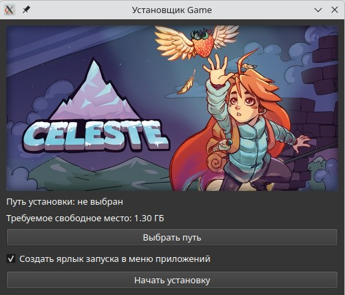
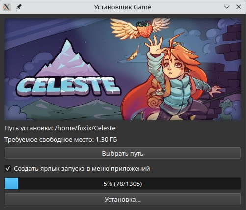
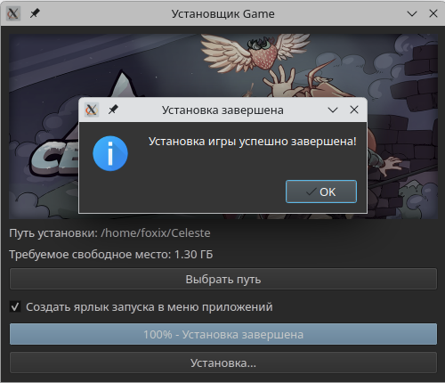
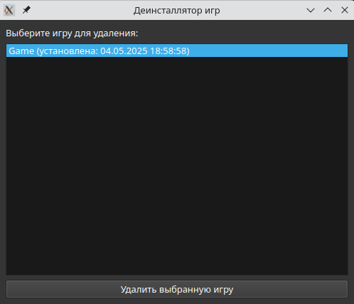
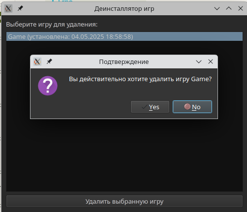

# Golang QT Installer for Native Linux Games


### Build manually
```sh
go mod download
go install
```
or
```sh
go build -o installer main.go
go build -o uninstaller uninstaller.go
```
### Screenshots Installer




### Screenshots Uninstaller



### 📝 **License**

This project is licensed under the [MIT](./LICENSE) license.
